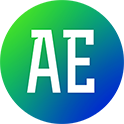

# Aelib

A library of Digital Assets, Presets and Scripts for SideFX Houdini.

The /otls folder contains many HDAs (mostly SOP level) which are available from the 'aelib' Tab submenu.

Highlights:
* Curve Tools - Framing, Carving, Offsetting, Duplication, UVs, Rounded corners and more
* Shape generators - Polyhedra, Parametric Curves, Capsule, CubeSphere, Softbox, Spirals
* A Plethora of utility SOPs - Ramp Manager, Neighbours, Orient, SVG Import/Export, Camera HUD, Containment
* Deformers - Sphere Inversion, 4D Transformation, Mandala, Polarise
* Useful Solvers - Accumulation, Temporal smoothing, Spring Solver, Chaotic attractors
* Tweaks to standard Houdini SOPs - Match Size, Axis Transform, Clip

Assets which are complete and stable have this icon:

'Work in progress' assets have this icon:

WIP assets are missing functionality or have known bugs.

## Installation (Houdini 17.5+)

* Download and extract the repository and move it to any location
* Create a folder called 'packages' in your Houdini home directory (e.g C:/Users/MY_USER/Documents/houdini18.0)
* Copy the Aelib.json file into the packages folder
* Edit the json file to point to the extracted Aelib folder (edit the "AELIB" line)
* For more information on how package files work, see [HERE](https://www.sidefx.com/docs/houdini/ref/plugins.html)

## Other

Video overviews of some tools may be found here https://vimeo.com/user27356169
They're quite old so functionality may be different.

The structure of this library is based on the qLib Houdini library https://github.com/qLab/qLib
qLib is and incredible resource and I would highly recommended installing it too.