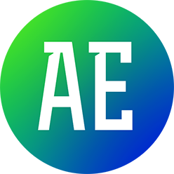

# Aelib

A library of Digital Assets, Presets and Scripts for SideFX Houdini. Video overviews of several tools may be found here https://vimeo.com/user27356169

The /otls folder contains many HDAs (mostly SOP level) which are available from the 'aelib' context menu. 

Assets which are mostly complete and stable are indicated by this icon:

Assets which are in progress are indicated by this icon:

WIP assets are usually missing some functionality or have known bugs/issues. 

## Installation

* Download the repository
* Extract and move into the Houdini config directory
* Append the provided houdini.env file to your own houdini.env

Evironment variables used:
* HOUDINI_OTLSCAN_PATH: the assets
* HOUDINI_GALLERY_PATH: gallery items
* HOUDINI_TOOLBAR_PATH: shelf tools
* HOUDINI_SCRIPT_PATH: scripts
* HOUDINI_VEX_PATH: custom Vex files (required in some assets) 

## Other

The structure of this library is inspired by qLib - a large open source Houdini library - https://github.com/qLab/qLib
Most of the assets found in Aelib will work in isolation. However, a few tools do make use of qLib so it is highly recommended that this is installed alongside Aelib.